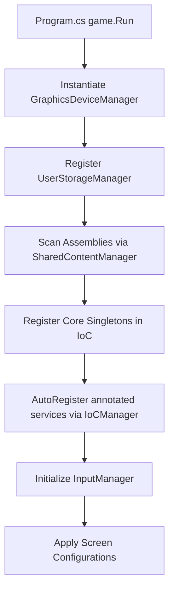

# Startup & Lifecycle (Boot)

This document explains the initialization sequence of the OIRF Engine, tracing execution from the program entry point to the running simulation ticks.

---

## 1. Entry Point (`Program.cs`)

Execution begins in the client executable's entry point (e.g. `Content.Client/Program.cs`):
1. Instantiates `ClientOptions` to configure window parameters (width, height, title, full screen, etc.) and lists the assemblies containing custom components.
2. Instantiates the game instance (a subclass of `GameClient` like `Content.EntryPoint`).
3. Invokes MonoGame's native `Run()` loop.

```csharp
// Content.Client/Program.cs
var options = new ClientOptions()
{
    Assemblies = new[] { typeof(EntryPoint).Assembly },
    Title = "ORIF Engine (Client)",
    Width = 1280,
    Height = 720
};

using var game = new Content.EntryPoint(options);
game.Run();
```

---

## 2. Setup Sequence in GameClient Constructor

The `GameClient` constructor registers all low-level singletons in the `IoCManager` container and prepares assembly bindings.



1. **UserStorageManager Setup**: Mounted first to determine saving paths.
2. **Assembly Scanning**: `SharedContentManager` loads client/shared assemblies to scan for types.
3. **Core Singletons Registration**:
   * Asset and Audio Managers (`IAssetManager`, `IAudioManager`).
   * UI, Window, and Scene Managers (`UIManager`, `WindowManager`, `SceneManager`).
   * Viewports and Cameras (`ViewportAdapter`, `Camera2D`, `RenderManager`).
   * ECS and Inputs (`EntityManager`, `InputManager`).
4. **Auto-Register**: Scans and registers classes annotated with `[RegisterIoC]`.
5. **Config Resolution**: Clamps viewport size options to match the current monitor specifications.

---

## 3. Initialization Hook (`Initialize()`)

Once MonoGame initializes the native graphic graphics card context:
* Instantiates `SpriteBatch`.
* Prepares the Myra UI context (`InterfaceManager.Init()`).
* Adds the `SceneManager` component to MonoGame's game components (`Components.Add(Scenes)`).

---

## 4. The Loading Stage Lifecycle

The game utilizes the `GameState` enum to govern update logic:

```csharp
public enum GameState
{
    Booting,
    Loading,
    Running,
}
```

### 1. Booting to Loading
On the first execution of `Update()`, `GameState` transitions from `Booting` to `Loading`.

### 2. The LoadingScene Stage
While `GameState == GameState.Loading`, `SceneManager` displays a loading splash screen (`LoadingScene`). This loading screen loads and initializes:
* Shaders compilation via `ShaderManager`.
* Localization files parsed into the Fluent `LocalizationManager`.
* Component declarations cached in the `ComponentFactory`.
* YAML files loaded by the `PrototypeManager`.
* Texture sheets loaded into the `AssetManager` to build the global atlas.

The loading scene type is configurable via `ClientOptions.LoadingScene` (defaults to `DefaultLoadingScene`). On `SceneManager.Initialize()`, the engine validates that this type derives from `LoadingScene` before instantiating it with `Activator.CreateInstance`; otherwise it throws.

### 3. Transition to Running
Once assets are fully loaded:
1. `GameState` transitions to `GameState.Running`.
2. The engine raises a global event: `EventBus.RaiseEvent(new LoadingFinishedEvent())`.
3. Systems transition into normal updates.

---

## 5. Main Game Loop (`Update` & `Draw`)

Once `GameState == GameState.Running`:

### Update Loop
1. **Delta Calculation**: Updates delta time clocks.
2. **Inputs Poll**: Updates `InputManager` states.
3. **UI Update**: Ticks `InterfaceManager` and `WindowManager`.
4. **ECS Update**: Ticks systems logic via `EntityManager.Update()`.

### Draw Loop
1. **Clear Screen**: Clears the canvas buffer.
2. **MonoGame Components**: Draw calls route through active game components (like `SceneManager`).
3. **ECS Draw**: Invokes systems render logic via `EntityManager.Draw()`.
4. **Queue Render**: Flushes all layers in `Renderer.DrawQueue()`.
5. **UI Draw**: Draws the UI and windows overlay (`InterfaceManager.Draw()`).
