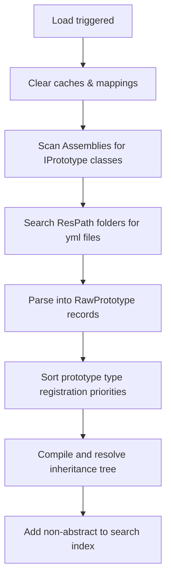

# Serialization & Prototypes Internals

This document details the serialization pipelines and prototype compilation routines that drive OIRF Engine's configuration workflow.

---

## 1. Loader Lifecycle (`Load()`)

When the loading scene executes, `PrototypeManager` updates the database in three main steps:



---

## 2. Assembly Registration (`ScanPrototypeTypes()`)

The manager scans registered assemblies to identify classes that:
1. Implement `IPrototype`.
2. Are decorated with `[Prototype(string typeKey, int loadPriority = 0)]`.

During this pass, the manager maps the string YAML `type` key to the CLR Type (e.g. `"entity"` translates to the `EntityPrototype` class). It also inspects properties carrying `[ComponentsDataField]` to treat them as custom component list structures during inheritance.

---

## 3. Inheritance Merging (`GetMergedFields()`)

Inheritance resolves dynamically using a recursive resolution algorithm to build a flat key-value dictionary of fields:

1. **Cycle Detection**: The manager maintains a recursion stack. If a prototype ID appears in its own parent traversal loop, the compiler throws a cyclic reference `PrototypeLoadException`.
2. **Deep Merge**:
   * Parent fields are merged sequentially into the target dictionary.
   * Direct overrides from the child overwrite parent properties.
   * Results are stored in `_mergedCache` to avoid re-evaluating parent trees.

### Components List Merging
Fields decorated with `[ComponentsDataField]` (such as `components` inside `entity` prototypes) are merged using a specialized list merge algorithm:
```csharp
private static void MergeComponentLists(List<object> target, List<object> source)
{
    foreach (var item in source)
    {
        // ...
        // 1. Matches child component 'type' keys with parent component listings.
        // 2. If a match is found, merges fields individually (child overwrites parent).
        // 3. Clones dictionaries to avoid shared mutable state references between prototypes.
    }
}
```

---

## 4. Instance Population & Conversion (`DataFieldConverter`)

Once fields are compiled, `PopulateInstance()` binds raw values to concrete properties using reflection:

### 1. Attribute Mapping
The manager matches YAML keys against properties decorated with `[DataField]`.
* If a property is marked as `[DataField("key", required: true)]` but missing in the compiled dictionary, a `PrototypeLoadException` is thrown.
* Unknown properties in YAML generate compiler warnings.

### 2. Reflection Binding
Binding values to properties uses `DataFieldConverter.Convert(Type targetType, object rawValue)`. It automatically resolves:
* Primitive numeric conversions.
* Struct mappings (e.g., `Vector2` from standard lists `[0, 0]`).
* Collections mapping (`List<T>`, arrays, dictionary structures).
* Enums parsing.

### 3. Non-Annotated Component Mapping
Unlike prototypes, components themselves (attached to entity templates) do not require `[DataField]` annotations. Their fields are bound directly by name using `DataFieldConverter.ApplyByName(object target, Dictionary<string, object> data)` using reflection.
