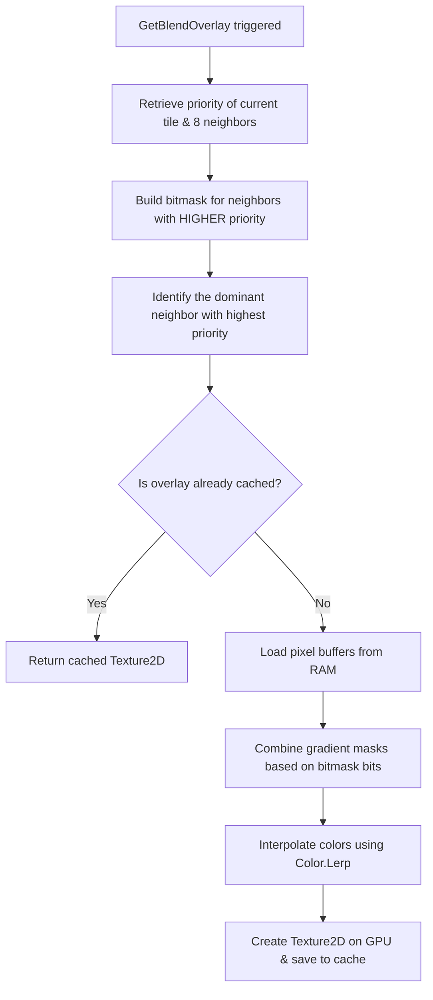

# Tilemap & Auto-tiling Engine Internals

This document covers the optimization designs and algorithmic details behind OIRF Engine's grid rendering systems, caching strategies, and terrain blending techniques.

---

## 1. Batch Optimization (`RenderableChunk`)

Drawing thousands of individual tiles by submitting separate sprite batch transactions creates massive GPU state bottlenecks. OIRF Engine optimizes this using a chunked rendering technique:

1. **Chunk Segregation**: Tiles are grouped into local grids (`TilemapChunk`) defined by `ChunkSize` (e.g. 16x16).
2. **Viewport Intersection Culling**: `TilemapSystem.Draw()` calculates the absolute screen coordinates of each chunk bounding box. If the chunk does not overlap with the camera's `ViewportBounds`, the system discards the drawing pass:
   ```csharp
   var chunkRect = new Rectangle((int)chunkWorldX, (int)chunkWorldY, worldChunkSize, worldChunkSize);
   if (!bounds.Intersects(chunkRect))
       return;
   ```
3. **Geometry Caching**: Instead of queueing entities, each chunk compiles its textures and calculated positions into a single flat `RenderableChunk` struct.
4. **Geometry Rebuilding (Dirty Flag)**: When `SetTile()` is invoked, the target chunk is flagged as `Dirty = true`. The system caches the draw geometry during the next tick and resets the flag.

---

## 2. Dynamic Auto-Tiling Blending (`TerrainBlendingSystem`)

When two different tile types meet (such as sand meeting grass), the engine automatically blends their boundaries using a pixel-space CPU blending pipeline:



### 1. Priority Evaluation
Each tile prototype defines a `blendPriority` integer. A tile will only blend over another if its priority is **strictly higher** (for example, grass with priority 1 grows over dirt with priority 0).

### 2. Neighbor Scanning & Bitmasking
The system scans 8 surrounding neighbors, setting bits in a bitmask when a neighbor has a higher priority:
* `BIT_UP` (1), `BIT_RIGHT` (2), `BIT_DOWN` (4), `BIT_LEFT` (8)
* `BIT_TL` (16), `BIT_TR` (32), `BIT_BL` (64), `BIT_BR` (128)

It also identifies the **dominant neighbor** (the one with the highest priority among the valid adjacent tiles).

### 3. Gradient Mask Compilation
The system generates floating-point mask overlays using pre-calculated gradient profiles:
* **Linear Gradients** (`CreateLinearMask`): Fades from a straight edge (used for top, bottom, left, right edges).
* **Radial Gradients** (`CreateCornerMask`): Fades radially out from a corner coordinate (used for corners).

These masks are combined into a single alpha coverage buffer.

### 4. CPU Pixel Interpolation & Texture Generation
If the bitmask is non-zero, the system:
1. Loads the raw pixel data for both the self tile and the dominant neighbor (cached in RAM during startup via `Texture.GetData`).
2. Interpolates color channels using `Color.Lerp(selfColor, neighborColor, alphaMask)`.
3. Creates a new dynamic `Texture2D` instance on the GPU.
4. Populates the texture using `SetData()` and caches it under a compound key:
   `"selfId_neighborId_bitmask_tileSize"`

---

## 3. Render Pass Integration

When `TilemapSystem` compiles the `RenderableChunk` (during `MakeRenderable`), it checks if `TileBlending` is enabled.
* For each valid tile, it queries `GetBlendOverlay(...)`.
* During rendering, the chunk first draws the base tile raw texture, and then immediately overlays the blended dynamic `Texture2D` (if one was returned) on top of it.
* Calling `InvalidateCache()` clears all stored textures from the graphics memory.
